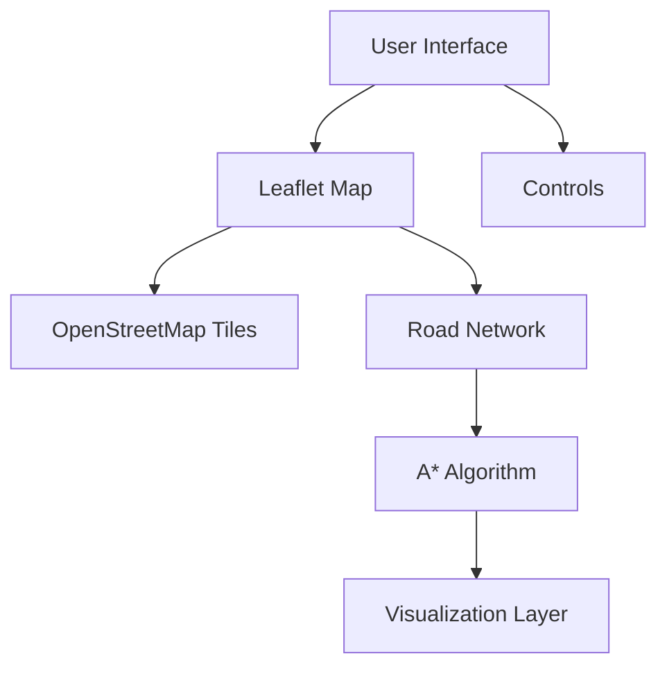

# A* Pathfinding Visualizer

An interactive visualization tool for A* pathfinding algorithm on real-world road networks using OpenStreetMap data.

## Features

- Real-time A* pathfinding visualization on actual road networks
- Interactive map interface with OpenStreetMap integration
- Adjustable search speed controls
- Geographic distance calculations using Haversine formula
- Dynamic road network loading with spatial indexing
- Visual representation of open set, closed set, and final path

## Technical Architecture



### Core Components

1. **A* Implementation**
   - Priority queue with optimized sorting
   - Haversine-based geographic heuristic
   - 8-directional movement support
   - Real-time visualization callbacks
   - Configurable search speed

2. **Road Network**
   - Spatial indexing using KDBush
   - Dynamic viewport-based loading
   - OpenStreetMap data integration
   - Efficient node lookup system

3. **Visualization**
   - Interactive Leaflet map interface
   - Real-time path progress display
   - Search space exploration visualization
   - Path reconstruction animation

## Getting Started

1. **Installation**
   ```bash
   # Install dependencies
   npm install
   ```

2. **Usage**
   ```javascript
   // Initialize pathfinder with road network
   const pathfinder = new AStarPathfinder(roadNetwork, startNode, endNode, updateVisuals);
   
   // Configure visualization speed (optional)
   pathfinder.setSpeed(5); // Range: 1-10
   
   // Start pathfinding
   const result = await pathfinder.findPath();
   ```

3. **Run the Demo**
   - Open `index.html` in a web browser
   - Click to set start and end points
   - Adjust speed using the controls
   - Watch the algorithm explore the road network

## Technical Details

### A* Implementation

```javascript
class AStarPathfinder {
    constructor(grid, startPos, endPos, visualCallback) {
        this.grid = grid;
        this.startPos = startPos;
        this.endPos = endPos;
        this.visualCallback = visualCallback;
        this.openSet = new PriorityQueue();
        this.closedSet = new Set();
    }
}
```

The implementation uses:
- Priority Queue for efficient node selection
- Haversine formula for geographic distance calculations
- Real-world coordinate system integration
- Asynchronous execution with visualization callbacks

### Performance Optimizations

1. **Spatial Indexing**
   - KDBush for efficient nearest-node queries
   - O(log n) lookup complexity
   - Optimized for geographic coordinates

2. **Priority Queue**
   - Custom implementation with sorted insertion
   - Efficient node selection strategy
   - Optimized for frequent updates

## Customization

Adjust search parameters through the following:

1. **Speed Control**
   ```javascript
   pathfinder.setSpeed(1); // Slower
   pathfinder.setSpeed(10); // Faster
   ```

2. **Visualization Options**
   - Modify node colors in style.css
   - Adjust animation timing
   - Configure path display options

## Dependencies

- KDBush: Spatial indexing
- Leaflet: Map visualization
- OpenStreetMap: Road network data

## Attribution

This project uses OpenStreetMap® data available under the Open Database License (ODbL). OpenStreetMap® is open data, licensed under the Open Data Commons Open Database License (ODbL) by the OpenStreetMap Foundation (OSMF).

https://www.openstreetmap.org/copyright

## License

This project is licensed under the MIT License - see the LICENSE file for details.