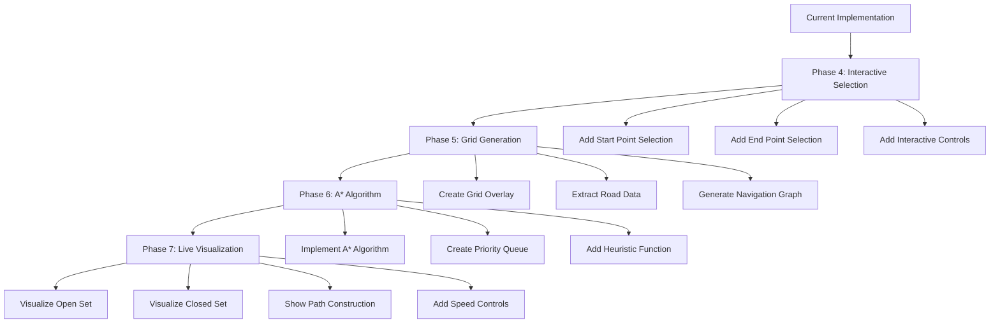

# Enhanced Map Integration Plan with A* Pathfinding Visualization

This document outlines the implementation plan for adding A* pathfinding visualization to the US map application.

## Implementation Phases

## Phase 4: Interactive Selection
- Add ability to click on the map to set start and end points
- Create clear visual indicators for selected points
- Add button to trigger pathfinding
- Enable resetting of points 

## Phase 5: Grid Generation
- Create a grid overlay on the selected 10x20 mile area
- Extract road data from the map tiles
- Identify traversable vs non-traversable cells
- Generate a navigation graph based on the grid

## Phase 6: A* Algorithm Implementation
- Implement core A* pathfinding algorithm
- Create priority queue for open set management
- Implement distance and heuristic calculations
- Prepare step-by-step execution to allow visualization

## Phase 7: Live Visualization
- Add visual representation of:
  - Open set (cells to be evaluated) in one color
  - Closed set (already evaluated cells) in another color
  - Current path in a third color
  - Final path when found
- Implement speed controls to adjust visualization pace
- Add status indicators showing algorithm metrics (nodes explored, etc.)
- Create animation frame loop for smooth transitions

## Technical Implementation Details

### Grid Structure
We'll overlay a grid on the selected map area, with each cell representing a small geographic area. The grid density will be configurable, balancing between algorithm visibility and geographic accuracy.

### Road Detection
We'll extract road data using:
1. OpenStreetMap data from the visible map tiles
2. Creating traversable paths along detected roads
3. Setting appropriate costs for different road types

### A* Implementation
The A* algorithm will:
1. Maintain an open set of nodes to explore (priority queue)
2. Track a closed set of already-evaluated nodes
3. Use a geographic distance heuristic (haversine formula)
4. Calculate actual path costs based on road types
5. Store parent references to reconstruct the optimal path

### Visualization Approach
For real-time visualization:
1. Execute the algorithm step-by-step
2. Update the display after each algorithm iteration
3. Use setTimeout/requestAnimationFrame for controlled animation
4. Allow pausing, resuming, and speed adjustment