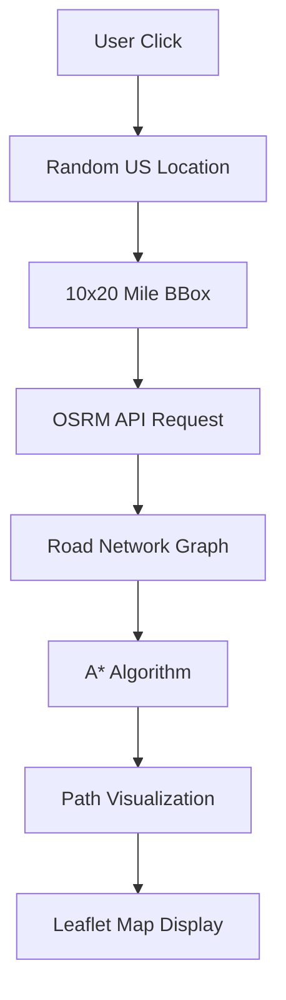
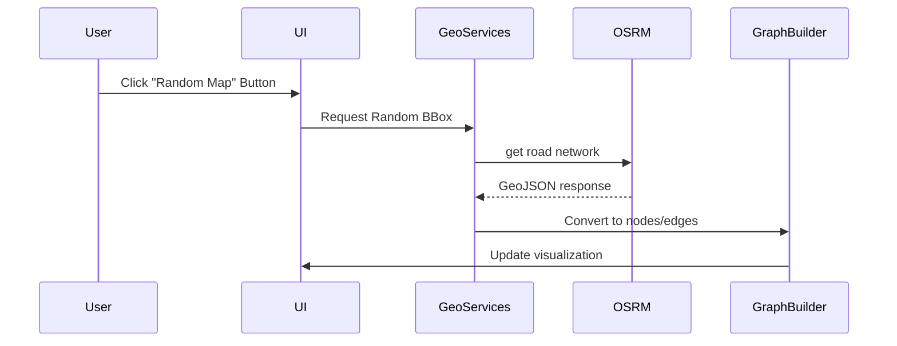

# Real-World Pathfinding Implementation Plan

## Architecture Overview


## Implementation Phases

### 1. Map Integration & Random Location


### 2. Core System Modifications
**Existing Components to Refactor:**
- GridSystem → RoadNetworkSystem
- Cell → RoadNode/RoadSegment
- AStar → GeospatialAStar

**New Dependencies:**
```json
{
  "dependencies": {
    "leaflet": "^1.9.4",
    "turf": "^7.0.0",
    "osrm-client": "^0.8.3"
  }
}
```

### 3. API Integration Plan
| Service | Endpoint | Rate Limit | Data Format |
|---------|----------|------------|-------------|
| OSRM | /route/v1/driving/{coordinates} | 5000/day | GeoJSON |
| Nominatim | /reverse?format=json | 1000/hour | JSON |

### 4. Road Network Graph Structure
```javascript
class RoadNetwork {
  constructor() {
    this.nodes = new Map(); // key: node_id, value: {lat, lon}
    this.edges = new Map(); // key: edge_id, value: {source, target, weight}
  }
  
  addNodeFromOSRM(osrmResponse) {
    // Parse OSRM nodes
  }
}
```

### 5. Modified A* Algorithm
```javascript
class GeospatialAStar {
  heuristic(nodeA, nodeB) {
    return turf.distance(
      turf.point([nodeA.lon, nodeA.lat]),
      turf.point([nodeB.lon, nodeB.lat])
    );
  }
}
```

## Risk Mitigation Strategies
1. Local OSRM fallback server setup
2. Web Worker pool for pathfinding
3. Quad-tree spatial indexing for road nodes
4. Progressive path rendering

## Estimated Timeline
| Phase | Duration | Milestone |
|-------|----------|-----------|
| Research | 3 days | API validation |
| Core Refactor | 5 days | Working geospatial A* |
| UI Integration | 4 days | Map visualization |
| Testing | 3 days | Cross-browser validation |