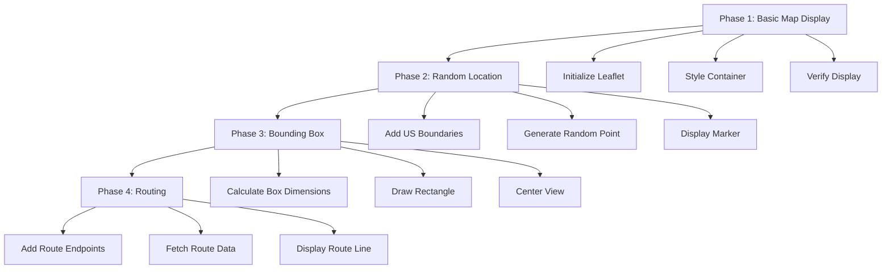

# US Map Integration Plan

This document outlines the incremental approach to implementing the US Map feature with random location selection.

## Implementation Phases

## Phase 1: Minimal Map Display

**Goal**: Get a basic Leaflet map displaying correctly

1. Simplify HTML to focus only on map display
2. Create minimal JavaScript for map initialization
3. Ensure CSS properly sizes the container
4. Add visual confirmation that map loaded

## Phase 2: Random Location Generation

**Goal**: Add button that generates and displays a random US location

1. Define US boundary box
2. Implement random coordinate generation
3. Add marker to show selected location
4. Update status text with coordinates

## Phase 3: Add Bounding Box

**Goal**: Display a rectangular 10mi × 20mi area

1. Implement proper geographic calculation for miles to lat/lng
2. Draw rectangular box centered on random point
3. Zoom map to show the box appropriately
4. Add visual styling for the box

## Phase 4: Add Routing (if needed)

**Goal**: Display real roads within the box

1. Fetch map tiles with road data
2. Implement simple endpoint selection
3. Add optional route calculation
4. Style the route display

## Testing Process

For each phase:
1. Start with a clean implementation
2. Verify it works before adding complexity
3. Add clear debugging outputs
4. Make the code maintainable and well-documented

This approach will help isolate problems quickly and ensure each component works before adding complexity.