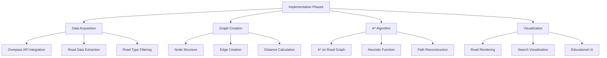

# OpenStreetMap A* Pathfinding Implementation Plan

This document outlines a comprehensive implementation plan for visualizing the A* pathfinding algorithm on real road networks using OpenStreetMap data.

## Project Overview

The goal is to create an interactive visualization that shows how A* pathfinding works on real road networks, providing an educational tool to help users understand the algorithm. Users will be able to:

1. Select an area on a map
2. Choose start and end points
3. Watch the A* algorithm explore the road network in real-time
4. See the final path highlighted on the map

## Implementation Flow



## 1. OpenStreetMap Data Acquisition

### Overpass API Integration
- Use Overpass API to fetch road network data
- Create a query builder function to extract roads within our 10x20 mile boundary
- Filter for highways, streets, and paths suitable for routing

```javascript
// Example Overpass API query
const query = `
[out:json];
way["highway"](${south},${west},${north},${east});
(._;>;);
out body;
`;
```

### Road Data Processing
- Parse OSM data into a usable format
- Extract nodes (points) and ways (road segments)
- Handle missing data and edge cases
- Implement caching to reduce API calls

## 2. Road Network Graph Creation

### Node & Edge Structure
- Create a graph structure representing the road network
- Store nodes as intersections with geographic coordinates
- Store edges as road segments with length, type, and other properties

```javascript
class RoadNode {
    constructor(id, lat, lng) {
        this.id = id;
        this.lat = lat;
        this.lng = lng;
        this.connections = []; // Edge references
    }
}

class RoadEdge {
    constructor(id, source, target, distance, roadType) {
        this.id = id;
        this.source = source;
        this.target = target;
        this.distance = distance; // meters
        this.roadType = roadType; // highway, primary, residential, etc.
    }
}
```

### Distance & Cost Calculation
- Implement Haversine formula for accurate geographic distances
- Add weighting based on road types (highways faster than residential)
- Handle one-way streets and prohibited turns
- Consider elevation data if available

## 3. A* Implementation for Road Networks

### A* Algorithm Adaptation
- Modify A* to work with road graph instead of grid
- Use priority queue for efficient open set management
- Handle the specific challenges of road networks

```javascript
class RoadPathfinder {
    constructor(graph, start, goal) {
        this.graph = graph;
        this.startNode = start;
        this.goalNode = goal;
        this.openSet = new PriorityQueue();
        this.closedSet = new Set();
        // ...
    }
    
    async findPath() {
        // A* algorithm specific to road networks
        // ...
    }
}
```

### Heuristic Function
- Use straight-line (crow-flies) distance as base heuristic
- Implement adjustments based on road network characteristics
- Ensure admissibility for optimal path finding
- Allow selection of different heuristics for educational purposes

### Path Reconstruction
- Trace back the optimal path through parent pointers
- Calculate total distance, estimated time, and other metrics
- Handle road name changes and turn instructions

## 4. Visualization & Educational Features

### Road Network Rendering
- Render roads using Leaflet polylines
- Style roads according to type (highways, main roads, residential)
- Show intersections as nodes
- Create a clean, informative map view

### Search Visualization
- Highlight roads as they're added to the open set (blue)
- Change color for roads in the closed set (purple)
- Show current best path during search (yellow)
- Display final path when found (green)
- Animate the search process with controllable speed

### Educational UI
- Add clear step counter and metrics panel
- Highlight key A* algorithm concepts (g-score, h-score, f-score)
- Include tooltips or explanations for different stages
- Add optional "explanation mode" with detailed algorithm steps
- Display comparative metrics against Dijkstra's algorithm

## 5. Implementation Tasks

1. Set up Overpass API query builder
   - Create a service for making Overpass API requests
   - Implement query generation based on bounding box
   - Add error handling and rate limiting

2. Create data model for road network graph
   - Define node and edge classes
   - Create graph class with necessary operations
   - Implement serialization for caching

3. Implement graph construction from OSM data
   - Parse OSM XML/JSON to extract nodes and ways
   - Build connections between nodes based on ways
   - Calculate edge weights based on road types and distances

4. Adapt A* algorithm for road networks
   - Implement priority queue
   - Create graph traversal logic
   - Add path reconstruction

5. Create visualization for the algorithm steps
   - Implement road rendering using Leaflet
   - Add visual states for different algorithm stages
   - Create animation system for step-by-step viewing

6. Add controls for algorithm visualization
   - Speed control slider
   - Step-by-step buttons
   - Play/pause functionality

7. Implement educational features
   - Add metrics panel
   - Create explanatory tooltips
   - Display current f, g, h scores

8. Add final metrics display
   - Total distance
   - Estimated time
   - Nodes explored
   - Algorithm efficiency metrics

## 6. Technical Considerations

### API Rate Limits
- Implement caching for OSM data
- Add throttling to respect Overpass API limits
- Consider fallback options for larger areas
- Add offline mode with pre-cached popular areas

### Performance Optimization
- Limit graph size to reasonable boundaries
- Use efficient data structures (QuadTree for spatial indexing)
- Optimize rendering for larger road networks
- Implement progressive loading for larger areas

### User Experience
- Add clear loading indicators
- Implement gradual road network loading
- Add fallback to simpler visualization for complex networks
- Ensure responsive design for different screen sizes

## 7. Testing Strategy

- Unit test the A* algorithm with known graph patterns
- Test with various real-world road configurations
- Verify algorithm correctness against known optimal paths
- Performance testing with large road networks
- Browser compatibility testing

## 8. Future Enhancements

- Compare multiple pathfinding algorithms (Dijkstra, BFS, etc.)
- Add traffic data integration for realistic routing
- Support for pedestrian and cycling-specific routing
- 3D visualization of routes with elevation data
- Mobile app version with offline capabilities