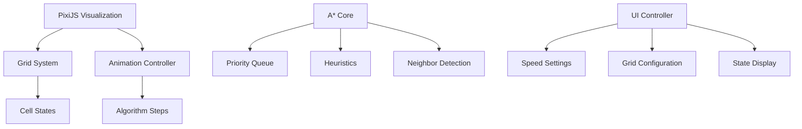

# A* Pathfinding Visualization Overhaul Plan

## Architecture Overview

## Phase 1: Grid Foundation & Rendering

- [ ] Create grid config system (cell size, colors, weights)
- [ ] Implement PixiJS base setup with resize handling
- [ ] Develop grid cell sprites with interactive states:
  - [ ] Walkable/Navigation
  - [ ] Start/End markers
  - [ ] Weighted cells
- [ ] Add grid generation controls

## Phase 2: Algorithm Decoupling

- [ ] Extract A* logic into separate module
- [ ] Implement algorithm step recorder
- [ ] Create visualization adapters:
  - [ ] Open set highlighting
  - [ ] Closed set tracking
  - [ ] Path reconstruction
- [ ] Add diagnostic logging system

## Phase 3: Animation System

- [ ] Develop animation queue manager
- [ ] Implement frame-by-frame stepping
- [ ] Create smooth transition effects:
  - [ ] Cell state changes
  - [ ] Path tracing
  - [ ] Algorithm exploration
- [ ] Add speed controls (0.5x-5x)

## Phase 4: UI Integration

- [ ] Build control panel with:
  - [ ] Grid size controls
  - [ ] Algorithm selection
  - [ ] Animation presets
- [ ] Add touch gesture support
- [ ] Implement mobile-responsive layout

## Recommended Implementation Order

1. Start with basic grid rendering
2. Add cell interaction handling
3. Integrate A* core with step recording
4. Build animation controller
5. Connect UI controls

## Migration Strategy

1. Create new `grid-visualizer` branch
2. Gradually replace D3 components
3. Maintain legacy map mode during transition
4. Final cleanup after testing