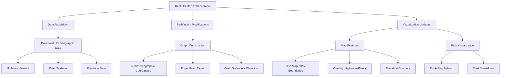

# A* Pathfinding with Real US Map Enhancement Plan

## Architecture Overview

## Implementation Phases

1. **Geospatial Data Integration**
   - Source data from USGS National Map API
   - Convert to TopoJSON format
   - Implement elevation data processing

2. **Graph Construction Modifications**
   - Replace grid system with geospatial nodes
   - Add terrain cost calculations based on:
     - Road classification (highway, local, etc.)
     - Elevation changes
     - Natural obstacles (rivers, mountains)

3. **A* Algorithm Enhancements**
   - Implement Haversine distance calculations
   - Add terrain cost multipliers
   - Create priority queue based on combined costs

4. **Visualization Improvements**
   - Layer management system for map features
   - Interactive legend with cost explanations
   - Path animation with progress metrics

## Next Steps
- Switch to Code mode for implementation
- Begin with data integration phase
- Follow iterative development approach