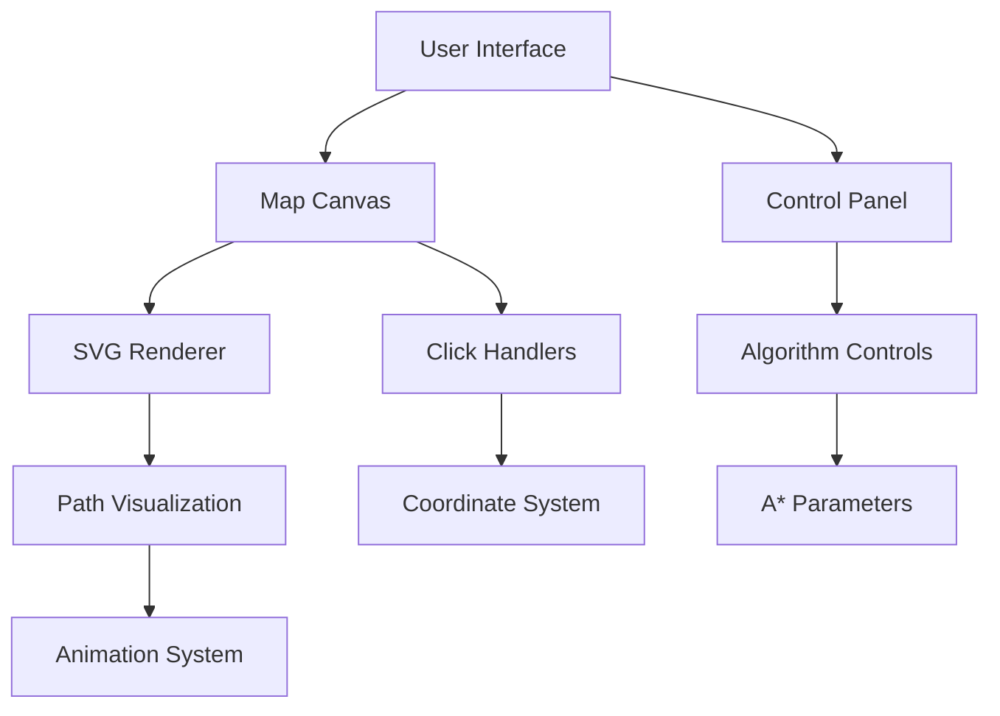

# A* Pathfinding Visualization Roadmap

## Implementation Checklist

### Phase 1: Base Infrastructure
- [ ] Create project structure
- [ ] Add core dependencies (D3.js, Lodash)
- [ ] Set up SVG coordinate system
- [ ] Implement basic click handlers

### Phase 2: Core Features
- [ ] A* implementation with terrain weights
- [ ] Dynamic obstacle generation
- [ ] Path reconstruction system
- [ ] Basic line animation

### Phase 3: Advanced Features
- [ ] Terrain difficulty visualization
- [ ] Animation speed control
- [ ] Path cost calculation
- [ ] Multi-agent support

### Phase 4: Polish & Optimization
- [ ] Mobile responsiveness
- [ ] Performance profiling
- [ ] Error handling
- [ ] Documentation